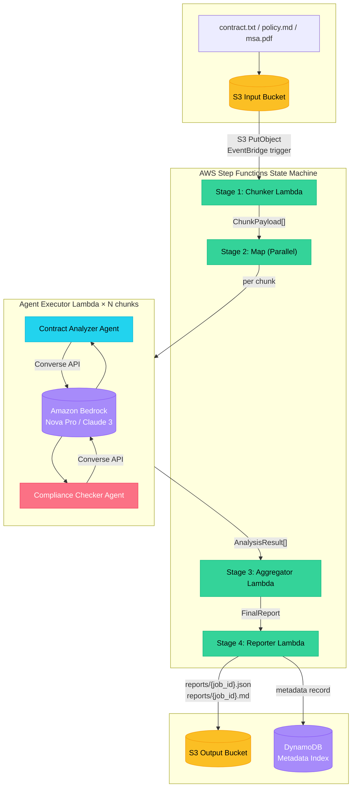

# Step Functions + Strands Agents: Intelligent Document Analysis

> **Production-grade demo:** AWS Step Functions orchestrates Strands Agents to perform multi-stage LLM analysis of legal and compliance documents.

[](https://www.python.org/downloads/)
[](https://aws.amazon.com/cdk/)
[](https://github.com/strands-agents)
[](LICENSE)

---

## Architecture Overview



### Pipeline Stages

| Stage | Service | Responsibility |
|-------|---------|----------------|
| **1. Chunk** | Lambda (`chunker`) | Reads S3 document, splits into semantic chunks with overlap |
| **2. Analyze** | Map → Lambda (`agent_executor`) | Runs **Strands Agents** in parallel on each chunk: contract analysis + compliance checking |
| **3. Aggregate** | Lambda (`aggregator`) | Deduplicates entities, ranks clauses/flags by risk, generates executive summary |
| **4. Report** | Lambda (`reporter`) | Writes JSON + Markdown reports to S3, indexes metadata in DynamoDB |

---

## Key Design Decisions

### Why Step Functions?

- **Visual orchestration:** State machine graph makes pipeline logic explicit and auditable
- **Built-in error handling:** Retry policies, catch states, and DLQs per task
- **Parallelism control:** Map state with configurable `max_concurrency` prevents Bedrock throttling
- **Observability:** CloudWatch Logs, X-Ray tracing, and execution history out of the box

### Why Strands Agents?

- **Structured output:** Pydantic-native result parsing without brittle regex
- **Tool composability:** Agents compose with external validators (RxNorm, NDC, etc.)
- **Bedrock-native:** Direct integration with Amazon Nova Pro / Claude 3 via Converse API
- **Resilience:** Built-in retry and backoff patterns for LLM inference

### Multi-Agent Pattern

Each chunk runs **two agents concurrently** via `asyncio.gather`:

1. **Contract Analyzer** → extracts entities, clauses, risk ratings
2. **Compliance Checker** → evaluates against SOC2/HIPAA/GDPR/FISMA controls

Results are merged into a single `AnalysisResult` per chunk, then aggregated across all chunks.

---

## Project Structure

```text
.
├── app.py                          # CDK app entry point
├── cdk.json                        # CDK configuration
├── cdk/
│   └── stacks/
│       └── document_analysis_stack.py  # Infrastructure as Code
├── src/
│   ├── agents/
│   │   ├── contract_analyzer.py    # Strands Agent: entity & clause extraction
│   │   └── compliance_checker.py   # Strands Agent: framework-specific compliance
│   ├── lambdas/
│   │   ├── chunker/
│   │   ├── agent_executor/
│   │   ├── aggregator/
│   │   └── reporter/
│   └── models/
│       └── schemas.py              # Pydantic v2 models for type-safe contracts
├── tests/
│   ├── conftest.py                 # Shared pytest fixtures
│   ├── test_agents.py              # Unit tests for Strands Agents (mocked Bedrock)
│   └── test_lambdas.py             # Unit tests for Lambda handlers (moto mocks)
└── pyproject.toml                  # Dependencies, ruff, mypy, pytest config
```

---

## Quick Start

### Prerequisites

- Python 3.11+
- AWS CLI configured with credentials
- AWS CDK installed (`npm install -g aws-cdk`)

### Deploy

```bash
# 1. Install dependencies
make install

# 2. Run tests
make test

# 3. Bootstrap CDK (first time only)
make cdk-bootstrap

# 4. Deploy stack
make cdk-deploy
```

### Trigger a Pipeline Run

```bash
aws stepfunctions start-execution \
  --state-machine-arn <StateMachineArn from outputs> \
  --input '{
    "document_key": "contracts/acme-2024.txt",
    "bucket": "<InputBucketName>",
    "framework": "soc2",
    "job_id": "demo-001",
    "context": {"project_id": "big-deal-2024"}
  }'
```

### Local Development

```bash
# Run a single Lambda handler locally
python -m lambdas.chunker.handler

# Run tests with coverage
make test-cov

# Lint and format
make lint
make format
```

---

## Compliance Frameworks

The `ComplianceChecker` agent is framework-aware. Supported standards:

| Framework | Controls Evaluated |
|-----------|-------------------|
| **SOC2** | Trust Services Criteria (CC6.1, CC7.2, A1.2, PI1.3, C1.1, P1.1) |
| **HIPAA** | §164.308 (Admin), §164.310 (Physical), §164.312 (Technical) |
| **GDPR** | Art. 32 (Security), Art. 33 (Breach), Art. 35 (DPIA), Art. 28 (Processor) |
| **FISMA** | NIST SP 800-53 (AC-2, AU-6, SC-28, RA-5) |

---

## Testing Strategy

| Layer | Tool | Coverage Target |
|-------|------|-----------------|
| Unit (Agents) | pytest + unittest.mock | ≥80% |
| Unit (Lambdas) | pytest + moto (S3, DynamoDB) | ≥80% |
| Integration | Local Step Functions + LocalStack | Manual |
| E2E | AWS Console / CLI | Per release |

Run the full suite:

```bash
pytest tests/ -v --cov=src --cov-report=term-missing
```

---

## Security & Production Hardening

- [ ] Scope Bedrock IAM policy to specific model ARNs (not `*`)
- [ ] Enable S3 bucket encryption (SSE-KMS)
- [ ] Add VPC endpoints for Bedrock and S3 if running in private subnets
- [ ] Enable AWS WAF on API Gateway if exposing HTTP trigger
- [ ] Rotate SNS email subscription to a distribution list
- [ ] Add DLQs for all Lambda functions
- [ ] Enable AWS Config for compliance drift detection

---

## Cost Estimate (per 1000 documents, ~10 pages each)

| Component | Unit Cost | Monthly Estimate |
|-----------|-----------|-----------------|
| Step Functions | $0.000025 per state transition | ~$5 |
| Lambda (ARM64) | ~$0.0000166667 per GB-second | ~$15 |
| Bedrock (Nova Pro) | ~$0.8 per 1M input tokens | ~$200 |
| S3 | $0.023 per GB | ~$1 |
| DynamoDB | On-demand | ~$2 |
| **Total** | | **~$223** |

*Assumes 10 chunks per document, 2 agent calls per chunk.*

---

## License

MIT © 2025 Winston Brown

---

## Related Reading

- [AWS Step Functions Developer Guide](https://docs.aws.amazon.com/step-functions/)
- [Strands Agents SDK](https://github.com/strands-agents/sdk-python)
- [Amazon Bedrock Converse API](https://docs.aws.amazon.com/bedrock/)
- [Pydantic v2](https://docs.pydantic.dev/)
